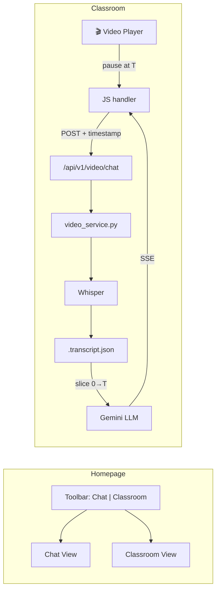

# Video Chat & Homepage Redesign — Walkthrough

## What Was Built

### Phase 1: Video Chat Backend
A Whisper-based transcription service that enables timestamp-bounded Q&A against lecture videos.

### Phase 2: Homepage Redesign
The homepage was reorganized into a modern, accessible layout with **Classroom** embedded as a tab (not a separate page), a redesigned toolbar, and quick-access cards.

## Architecture



## UI Changes

### Before → After

````carousel

<!-- slide -->

<!-- slide -->

````

## Key Changes

### Toolbar Redesign
| Before | After |
|---|---|
| Emoji buttons scattered unevenly | SVG-icon + label buttons with clear grouping |
| No active-state indicator | Active tab has accent underline |
| "Video Chat" was text-only link | "Classroom" is a first-class tab in center nav |
| No visual hierarchy | Left (brand) → Center (nav) → Right (actions) |

### Quick-Access Cards
- 🎬 **Classroom** — Watch lectures & ask questions
- 📊 **Dashboard** — View your progress & mastery
- ⚙️ **Settings** — Accessibility & custom instructions

### Accessibility Features
- ARIA labels on all interactive elements
- `focus-visible` outlines for keyboard navigation
- Large touch targets (minimum 44px)
- Clear icon + text labels (icons-only on mobile)
- Responsive: cards stack vertically on small screens

## Files Modified

| File | What Changed |
|---|---|
| [index.html](file:///Users/mhr6wb/Library/CloudStorage/OneDrive-UniversityofMissouri/Projects/AI-Tutor/backend/app/templates/index.html) | Complete restructure: toolbar, quick-access cards, embedded classroom view |
| [chat.css](file:///Users/mhr6wb/Library/CloudStorage/OneDrive-UniversityofMissouri/Projects/AI-Tutor/backend/app/static/css/chat.css) | New toolbar, quick-card, and classroom-view styles (~550 lines added) |
| [chat.js](file:///Users/mhr6wb/Library/CloudStorage/OneDrive-UniversityofMissouri/Projects/AI-Tutor/backend/app/static/js/chat.js) | View switching (Chat↔Classroom) + full classroom Q&A logic (~350 lines added) |

## What Was Tested

1. ✅ Welcome page displays with quick-access cards
2. ✅ Toolbar renders with Chat (active) and Classroom nav buttons
3. ✅ Clicking **Classroom** switches to embedded video view
4. ✅ Video auto-selects, plays, and pauses correctly
5. ✅ Clicking **Chat** switches back to the chat view
6. ✅ Quick-access cards are clickable (Classroom, Dashboard, Settings)
7. ✅ Mobile responsive: labels hide, cards stack vertically
