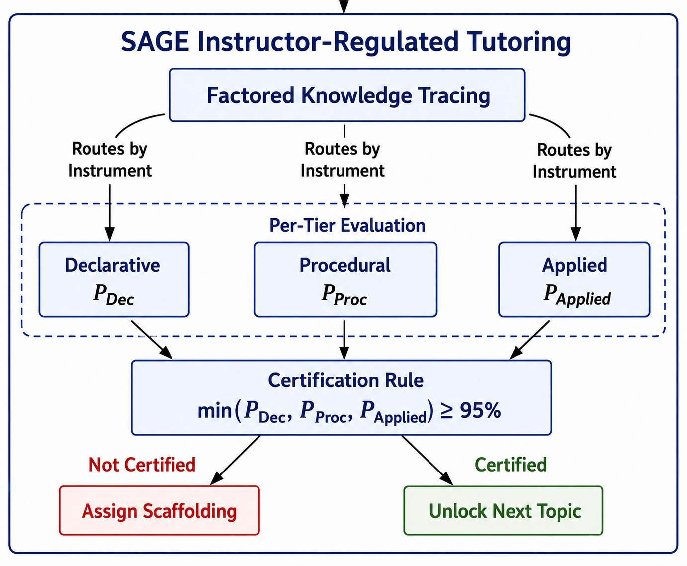
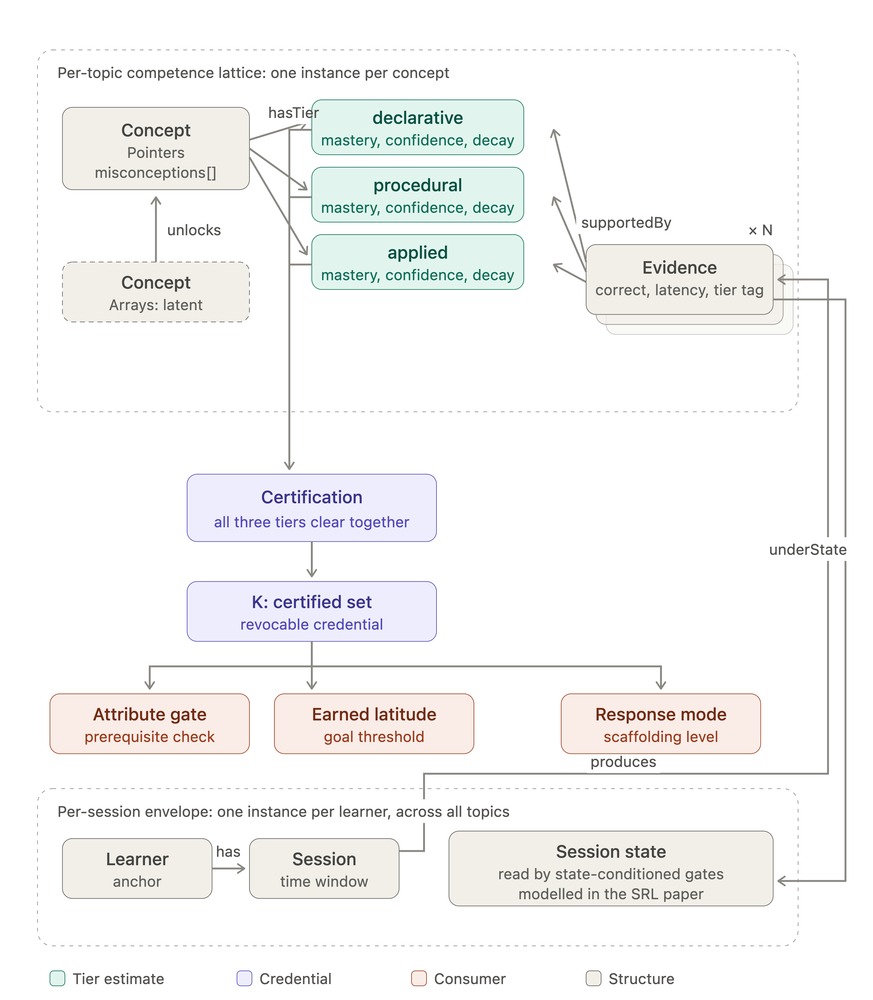
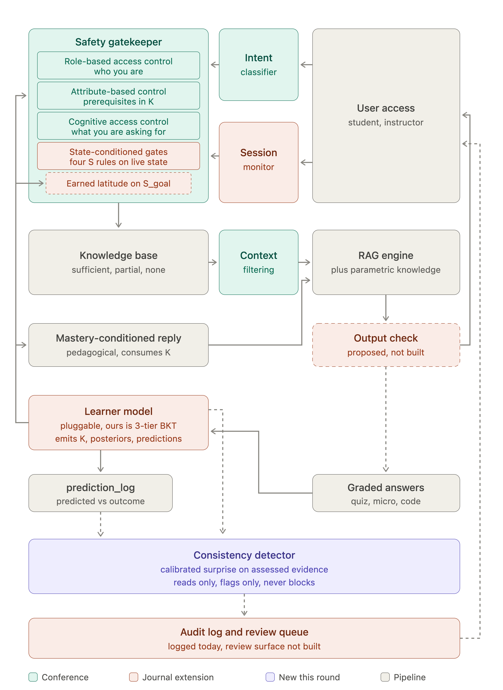

# The SAGE Learner Model — Data Structure

*How SAGE represents everything it knows about a student, and why that representation
is the hinge of the system's security.*

---

## 1. In one line

SAGE's learner model is **one typed graph**. It turns raw interactions into a
**revocable credential**: evidence updates a concept's competence, competence
certifies conjunctively, and the resulting credential **K** is what the tutor reads
to decide access, latitude, and how much help to give.

The picture is deliberately **not static** — the same structure grows, updates, and
decays over a session. That is the property a one-time diagnostic model does not have.

---

## 2. The learner model

> **Figure 1 — Learner model: factored knowledge tracing with conjunctive certification.**



The learner model is a **factored, three-tier knowledge tracer**. A single concept is
not one number; it is tracked three ways, by the *instrument* that produced the evidence:

| Tier | Instrument | What it means |
|------|------------|---------------|
| **Declarative** `P_Dec` | quiz | *knows the fact* |
| **Procedural** `P_Proc` | micro-challenge | *can execute it* |
| **Applied** `P_Applied` | code review | *can use it in real code* |

**Certification rule (conjunctive):**

```
certified(concept)  ⇔  min(P_Dec, P_Proc, P_Applied) ≥ θ_certify   (θ_certify = 0.95)
```

- Certification requires **all three tiers to clear together** — the whole point. A high
  quiz score alone certifies nothing.
- It is **sticky-with-hysteresis**: once certified it takes a drop below `θ_decertify = 0.75`
  to revoke, so the state does not chatter.
- Each tier estimate **decays** without practice, so a stale competence loses its
  certification.

Outcome branches: **not certified → assign scaffolding**; **certified → unlock the next topic.**

---

## 3. The data structure — one graph


> **Figure 2 — The learner-model data structure: a per-topic competence lattice and a
> per-session envelope, joined at the evidence, terminating in the credential K.**




The graph has **two scopes** that meet at one node type.

### 3.1 Per-topic competence lattice — *one instance per concept*

| Node | Attributes | Notes |
|------|------------|-------|
| **Concept** | `certified`, `ever_certified`, `misconceptions[]` | one per topic (Pointers, Arrays, …) |
| **Tier** ×3 | `mastery`, `confidence`, `decay λ` | declarative / procedural / applied |
| **Evidence** `× N` | `correct?`, `latency`, `tier tag` | one node per interaction |
| **Certification** | `min(tiers) ≥ 0.95` | the conjunctive gate |
| **K — certified set** | *revocable credential* | the output of the lattice |

**Edges**

- `Concept —hasTier→ Tier` — a concept owns its three tiers.
- `Concept —unlocks→ Concept` — the prerequisite DAG (a prerequisite *unlocks* its dependant).
- `Evidence —updates→ Tier` — evidence *arrives and moves* the estimate (not the reverse).
- `Tiers —certify→ K` — all three feeding the certification gate produce the credential.

### 3.2 Per-session envelope — *one instance per learner, across all topics*

| Node | Holds |
|------|-------|
| **Learner** | anchor |
| **Session** | time window |
| **Session state** | the per-user signals — **cognitive** (load, latency, slip-vs-gap, automatization), **affective** (frustration, flow, trajectory), **metacognitive** (self-monitoring, help-seeking, pacing), **motivational** (self-efficacy, interest, goal, grit, engagement) |

Session state is **read by state-conditioned gates** (the `S` rules) — the behavioural
signals modelled in detail in the SRL paper.

### 3.3 Evidence is the join

Every **Evidence** node has **one foot in each scope**: it `updates` a tier (topic scope)
*and* it is `underState` — carrying the session state it was gathered under (session scope).
That single dual-attachment is what lets a per-topic competence model and a per-session
behavioural model live in **one** graph instead of two.

### 3.4 The credential and its consumers

`K` does not just sit in the model — three parts **read** it:

| Consumer | Reads K for |
|----------|-------------|
| **Attribute gate** | prerequisite check — may this topic be unlocked? |
| **Earned latitude** | goal threshold — how much freedom on risky requests? |
| **Response mode** | scaffolding level — how much help to show? |

This is why the learner model is a **security** object and not just a progress bar:
competence terminates in a credential that enforcement reads, and the credential can be
**revoked, decayed, and audited.**

---

## 4. How to read the graph (walkthrough)

Follow the arrows top-to-bottom — never read it flat.

1. **Two boxes** — top is per-topic, bottom is per-session.
2. **Evidence** (top right) — every interaction becomes one node; `× N` means many.
3. **Evidence updates the tiers** — declarative / procedural / applied, each with mastery + confidence + decay.
4. **Certification** — a concept certifies only when *all three tiers clear together*.
5. **K: certified set** — certification produces the **revocable credential**. This is the hinge.
6. **Consumers** — the attribute gate, earned latitude, and response mode all *read* K; session state feeds the same gates.

**Punch line:** competence flows one way — evidence → tiers → certification → credential →
enforcement — and because K can be **revoked and decayed**, the system can take back access
when mastery lapses.

---

## 5. What makes it dynamic

A cognitive-diagnosis model draws its picture once, from a fixed test. This structure stays
live through three data-structure operations:

- **`insert`** — new evidence adds nodes (the graph *grows*).
- **`update`** — evidence moves a tier's mastery + confidence.
- **`decay`** — estimates fall without practice; certification can flip `certified → decertified`.

`confidence` is a second axis alongside `mastery`: it grows with evidence density, so a lucky
early answer reads as *high mastery / low confidence* — untrustworthy until backed by evidence.

---

## 6. Where it sits in the system


> **Figure 3 — System architecture: the learner model emits K and predictions; the safety
> gatekeeper and the consistency detector consume them.**



- The **safety gatekeeper** reads K through role-based and **attribute-based access control**
  (prerequisites in K), the **state-conditioned gates**, and **earned latitude on `S_goal`**.
- The **mastery-conditioned reply** consumes K to set its pedagogical stance.
- The **learner model** (pluggable; ours is the 3-tier BKT) emits **K, posteriors, and predictions**;
  `prediction_log` records predicted-vs-outcome.
- The **consistency detector** reads the learner model and the graded answers (never blocks —
  reads only, flags only) and routes to the **audit log / review queue**.

---

## 7. Positioning — what is borrowed, what is earned

**Borrowed (concede it):**

- Graphs of learner state — the Open Learner Model tradition.
- Prerequisite DAGs and multi-attribute competence — the defining move of cognitive-diagnosis models.

**Earned (the combination):**

- Nodes **instantiate and grow** with evidence, carry **mastery + confidence**, split by
  **depth of knowing** (declarative / procedural / applied), and **decay**.
- The lattice **terminates in a revocable credential K** that enforcement reads — the learner
  model used as an **access-control primitive**, not a diagnostic.

---

*Parameters referenced above:* `θ_certify = 0.95`, `θ_decertify = 0.75`, `N_MIN = 3` evidence
per tier; per-tier decay `λ` (quiz < micro < code). Values are the deployed defaults.
/