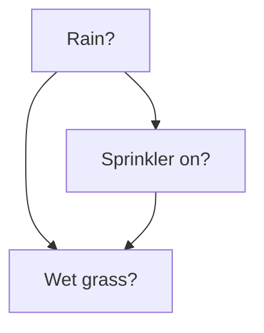
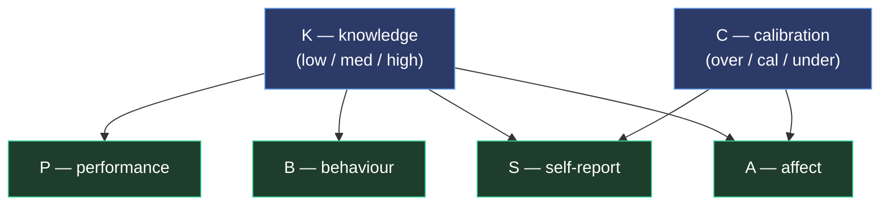
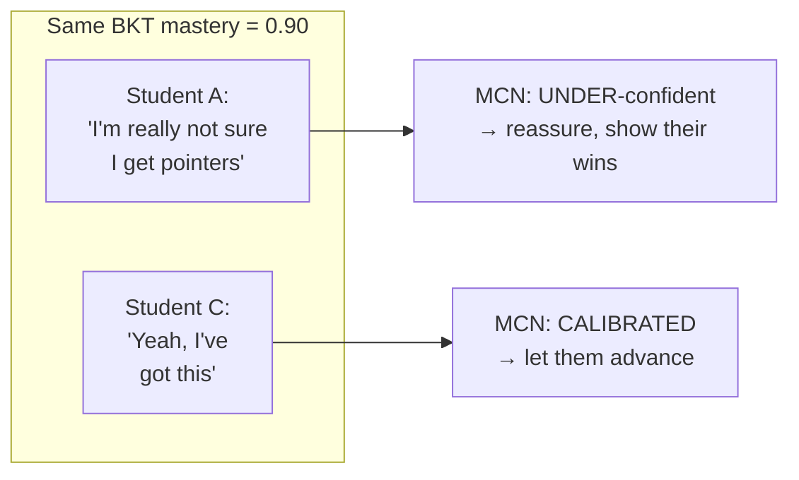
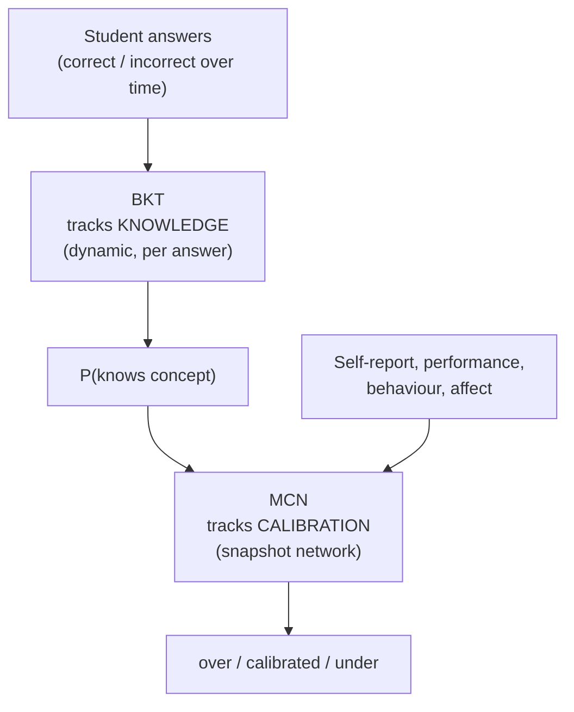
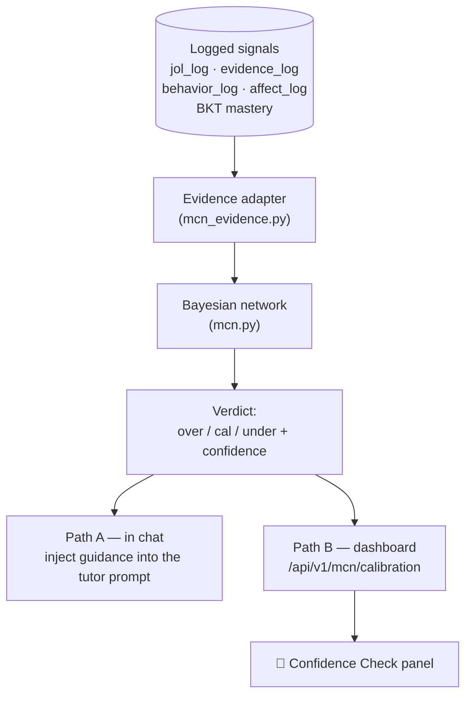
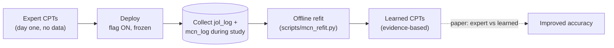
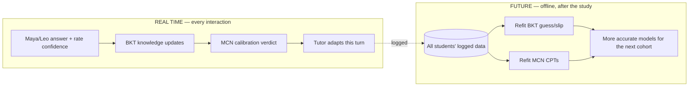
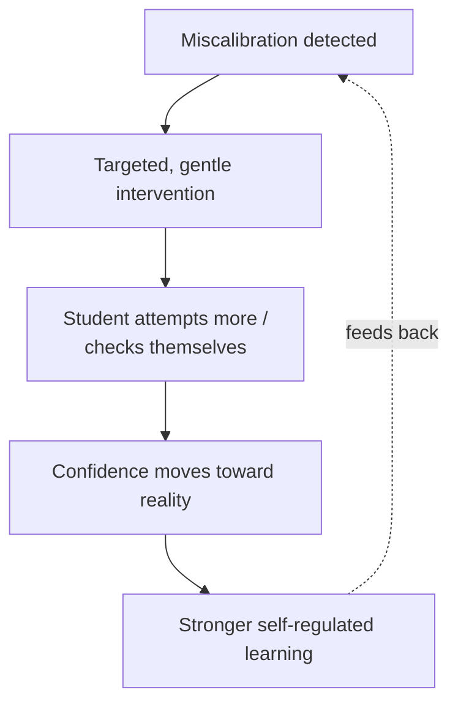

# The Metacognitive Calibration Network (MCN) — A Complete Explainer

*A from-scratch walkthrough of the Bayesian network we added to the SAGE-SRL tutor:
what it is, how and why it works, why we need it, how it differs from BKT, how it
shows up in the UI, how it will be recalibrated from real data, and how it improves
learning. Written to be readable without prior knowledge of Bayesian methods.*

---

## TL;DR (one paragraph)

BKT already tells us **what a student knows**. The MCN adds a second, orthogonal thing:
**whether the student's own sense of what they know is accurate.** It is a small
**Bayesian network** — a set of variables connected by arrows that say "this influences
that," with probability tables attached. It takes signals we already log (a confidence
rating, recent performance, help-seeking behaviour, frustration) and infers whether the
learner is **over-confident, well-calibrated, or under-confident** on a topic — then
nudges the tutor to respond accordingly (reassure the doubter, gently check the
over-confident). Today its probability tables are set by expert judgement; after the
classroom study we will **recalibrate those tables from real data.**

---

## 1. What is a Bayesian Network?

A **Bayesian network (BN)** is a way to reason about **causes you can't see** from
**effects you can**.

It has three ingredients:

1. **Nodes** — variables (e.g. "is it raining?", "is the grass wet?").
2. **Arrows** — "this variable influences that one." An arrow from Rain → Wet Grass
   means rain *causes* wet grass (probabilistically).
3. **Conditional Probability Tables (CPTs)** — numbers that quantify each arrow:
   *"if it's raining, the grass is wet 90% of the time; if not, 20% of the time."*

The classic textbook example:



The magic is **inference**: you *observe* an effect (wet grass) and the network tells
you the **probability of each hidden cause** (rain vs. sprinkler). And it does
**"explaining away"** — if you then learn it's raining, the probability that the
sprinkler was on *drops*, because the rain already explains the wet grass.

> **Key idea:** a BN runs the arrows *backwards* — from observations to the most
> probable hidden explanation — using the rules of probability.

Our network uses exactly this machinery, but the hidden cause we care about is not rain
— it's the student's **calibration**.

---

## 2. How does it work? (the mechanics)

### The variables

| Symbol | Meaning | Possible states | Hidden or observed? |
|---|---|---|---|
| **K** | true **K**nowledge of the topic | low / med / high | hidden (estimated by BKT) |
| **C** | **C**alibration (self-awareness) | over / cal / under | **hidden — this is what we want** |
| **S** | **S**elf-report (stated confidence) | low / med / high | observed |
| **P** | recent **P**erformance | poor / mixed / good | observed |
| **B** | **B**ehaviour (help-seeking/fluency) | struggling / normal / fluent | observed |
| **A** | **A**ffect (frustration) | frustrated / neutral / engaged | observed (optional) |

### The structure



Blue = hidden variables we infer; green = observed evidence.

The single most important arrow-pair is **{K, C} → S**: the student's stated confidence
is caused by **both** their real knowledge *and* their calibration bias. That is the
whole trick — read on to §3.

### The probability tables (real values from our system)

Here is the actual table for **P(self-report | knowledge, calibration)** — the heart of
the model (`backend/app/core/mcn.py`, `DEFAULT_CPT`):

| Knowledge K | Calibration C | → says "low" | "med" | "high" |
|---|---|---|---|---|
| high | **calibrated** | 0.05 | 0.25 | **0.70** |
| high | **over** | 0.02 | 0.18 | 0.80 |
| high | **under** | **0.50** | 0.40 | 0.10 |
| low | **calibrated** | **0.70** | 0.25 | 0.05 |
| low | **over** | 0.15 | 0.35 | **0.50** |
| low | **under** | 0.85 | 0.13 | 0.02 |

Read the bold cells: a **high-knowledge calibrated** student usually says "high" (0.70);
a **high-knowledge under-confident** student usually says "low" (0.50) *despite* knowing
it. That contrast is what lets the network detect under-confidence.

### Inference: a worked example (with real numbers)

Suppose a student shows **S = low** (says "not confident") and **P = good** (aced recent
questions). What's their calibration?

The network scores every combination of (K, C) — 3 × 3 = 9 — by multiplying the priors
and the relevant CPT cells:

```
score(K, C) = P(K) · P(C) · P(S=low | K, C) · P(P=good | K)
```

Using the defaults `P(K)={low .5, med .3, high .2}`, `P(C)={over .25, cal .5, under .25}`,
and `P(P=good|K)={low .07, med .25, high .65}`, the biggest scorers are:

| (K, C) | calculation | score |
|---|---|---|
| (high, **under**) | .2 · .25 · .50 · .65 | **.01625** |
| (low, cal) | .5 · .5 · .70 · .07 | .01225 |
| (med, under) | .3 · .25 · .60 · .25 | .01125 |
| (high, cal) | .2 · .5 · .05 · .65 | .00325 |

Summing by calibration and normalising gives the **posterior**:

```
P(over)  ≈ 5%
P(cal)   ≈ 38%
P(under) ≈ 57%   ← winner
```

So from just two signals the network already leans **under-confident**. Add **B = fluent**
(smooth, few hints) and the objective **BKT knowledge prior (high)**, and it sharpens to
**≈ 80% under-confident, knowledge high** — exactly the "competent but doubts themselves"
student. (This is the real output of `infer()` in our tests.)

Because the network is tiny, this enumeration is exact and instant — no approximation,
no external solver.

---

## 3. Why does it work? (the intuition)

Three ideas do all the work:

**(a) Separate "what you know" from "what you think you know."**
Most systems collapse these into one number. We keep **K** (knowledge) and **C**
(calibration) as *different variables*. Calibration is then modelled as the **bias** in
self-report relative to true knowledge:

```
  calibrated  →  confidence tracks knowledge
  over        →  confidence sits ABOVE knowledge
  under       →  confidence sits BELOW knowledge
```

**(b) Explaining away.**
If a student performs *well* but reports *low* confidence, the network cannot explain
that with "low knowledge" (performance contradicts it), so the remaining explanation —
**under-confidence** — becomes far more probable. The good performance "explains away"
the low self-report as a calibration issue, not a knowledge issue. A simple averaging
formula (`0.6·knowledge + 0.4·confidence`) *cannot* do this; it would just report a
mediocre blended score and miss the story entirely.

**(c) Fusing weak signals into a strong conclusion.**
No single signal is decisive — confidence is noisy, one quiz is luck, behaviour is
coarse. But multiplying several independent-ish likelihoods concentrates the posterior:
three weak agreements become one confident verdict, and disagreements are handled
gracefully rather than by a brittle if/else.

---

## 4. Why is it needed?

Because **BKT is blind to metacognition.** Consider two students with *identical* BKT
mastery on Pointers (`P(knows) = 0.9`):



BKT gives the **same** answer for both and would treat them identically. But they need
**opposite pedagogy**: A needs a confidence boost; C is ready to move on. The difference
isn't in their knowledge — it's in their *relationship to* their knowledge, which is
precisely the **metacognitive / self-regulated-learning** dimension BKT structurally
cannot see.

The costs of ignoring it are real:
- **Under-confident** students under-attempt, over-ask for help, and can quietly
  disengage even though they're doing fine.
- **Over-confident** students skip practice and hit a wall later, when it's harder to
  recover.

Calibration accuracy (how well your confidence matches reality) is a *core* SRL
construct — the MCN is how the tutor sees and acts on it.

---

## 5. How is it different from BKT?

They answer **different questions** and are **layered**, not competing.



| | **BKT** (existing) | **MCN** (new) |
|---|---|---|
| Question | "Does the student **know** it?" | "Does the student know **whether** they know it?" |
| Construct | Knowledge (cognitive) | Calibration (**meta**cognitive) |
| Model type | **Dynamic** Bayesian model (one hidden variable evolving over time) | Bayesian **network** (several variables, inferred at one moment) |
| Updated by | Each correct/incorrect answer | A snapshot of multiple signals |
| Needs the other? | No — stands alone | **Yes — reads BKT as its knowledge input** |
| Role in paper | Student-model *substrate* (not novel) | The novel **SRL contribution** |

**In one line:** BKT is the yardstick of what the student actually knows; the MCN
measures the *gap* between that yardstick and the student's own belief.

---

## 6. How is it implemented in the UI?

Two delivery paths, both flag-gated OFF by default (`MCN_ENABLED`).

### The data flow



### Path A — in the conversation (the real pedagogical payoff)

When you ask about a topic, the tutor computes your calibration and, if you're
mis-calibrated, silently adds an instruction to its own prompt:

- **Under-confident →** *"This learner clearly grasps the material but rates themselves
  too low — affirm their demonstrated competence, reference their correct answers, build
  confidence."*
- **Over-confident →** *"This learner rates themselves higher than their performance
  supports — weave in one pointed check question before moving on."*

You never see the machinery — you just get a more appropriately-pitched reply.

### Path B — the dashboard panel ("🧭 Confidence Check")

A card that appears only when the feature is on and there's enough signal:

```
┌─────────────────────────────────────────────────────────────┐
│ 🧭 Confidence Check                                       ⓘ  │
├───────────────────────────┬─────────────────────────────────┤
│ 💪 Pointers      UNDERRATING │ 🔎 Recursion       OVERRATING  │
│ You know this better than    │ Worth a quick double-check     │
│ you think                    │                                │
│ confidence 80%               │ confidence 71%                 │
├───────────────────────────┴─────────────────────────────────┤
│ ✅ Arrays        CALIBRATED                                   │
│ Your confidence matches your performance                     │
│ confidence 66%                                               │
└─────────────────────────────────────────────────────────────┘
```

This is an **Open Learner Model** — it makes the student's *metacognitive* state visible,
which is itself an SRL intervention (it prompts self-reflection).

### Safety

The MCN only informs **prompts and display**. It **never** changes the certified-mastery
number or the prerequisite gate — those always read BKT. Turn the flag off and the tutor
behaves exactly as before.

---

## 7. How will the CPTs be calibrated when real data arrives?

Right now the probability tables are **expert-set best guesses**. Once the class
generates data, we replace guesses with counts. This is **Bayesian parameter learning**:
*start from the expert table as a prior, then let real observations pull it toward what
actually happened.*

### 7a. The easy tables — direct counting

Some tables need no latent reasoning. Take **P(performance | knowledge)**. We have, for
every answered item, the BKT knowledge level at the time (K) and whether they got it
right (→ performance P). Just count.

**Dummy data** — 100 items where BKT said the student's knowledge was **high**:

| observed performance | count |
|---|---|
| good | 68 |
| mixed | 25 |
| poor | 7 |

**Update rule (Dirichlet counting):** treat the expert table as *pseudo-counts*, add the
real counts, renormalise.

```
expert P(P | K=high) = {good .65, mixed .30, poor .05}   (strength 10 → counts {6.5, 3, 0.5})
observed counts                                          = {68, 25, 7}
posterior counts        = {74.5, 28, 7.5}   → total 110
LEARNED P(P | K=high)   = {good .677, mixed .255, poor .068}
```

The table barely moved because the expert guess was already good — but now it's
**evidence-based**, and where the guess was wrong, the data corrects it.

### 7b. The hard table — calibration `P(S | K, C)` when C is hidden

`C` (calibration) is never directly observed, so we can't just count. Two options:

**Option 1 — a calibration proxy label (simple, recommended first pass).**
Calibration *is*, by definition, the mismatch between stated confidence and actual
correctness. So for each JoL event we can assign a proxy calibration label:

| stated confidence (S) | actually correct? | proxy label for C |
|---|---|---|
| high | ✗ wrong | **over** |
| low | ✓ correct | **under** |
| high | ✓ correct | calibrated |
| low | ✗ wrong | calibrated |

Now every `jol_log` row gives us a `(K from BKT, C proxy, S = confidence)` triple, and we
count exactly as in 7a.

**Dummy `jol_log` data** for students whose BKT knowledge was **high**:

| # | confidence (S) | correct? | K | C proxy |
|---|---|---|---|---|
| 1 | low  | ✓ | high | under |
| 2 | low  | ✓ | high | under |
| 3 | med  | ✓ | high | under\* |
| 4 | low  | ✓ | high | under |
| 5 | high | ✓ | high | calibrated |
| … | … | … | … | … |

\*graded under via a finer confidence-vs-score margin.

Say among **(K=high, C=under)** events we observe self-report S = **{low: 40, med: 25,
high: 5}**. Update the calibration cell:

```
expert P(S | high, under) = {low .50, med .40, high .10}   (strength 10 → {5, 4, 1})
observed counts                                            = {40, 25, 5}
posterior counts          = {45, 29, 6}   → total 80
LEARNED P(S | high, under)= {low .5625, med .3625, high .075}
```

**Interpretation:** real under-confident-but-capable students report "low" *even more
often* (0.56) than the expert guessed (0.50). The model just got sharper at spotting
them — automatically.

**Option 2 — Expectation-Maximization (rigorous, no labels needed).**
Treat C as genuinely latent and iterate:
1. **E-step:** with the current CPTs, infer P(C | evidence) for every student-item.
2. **M-step:** update the CPTs using those probabilities as soft counts.
3. Repeat until stable.

EM needs no proxy labels and is the "correct" method for a latent variable; the proxy
approach is more transparent and a fine starting point. The paper can report both.

### The learning loop



Because the CPTs live in an editable JSON file (`mcn_cpts.json`) with **hot reload**, the
learned tables can be dropped in **without a redeploy**. (For a clean study we keep them
*frozen during* the class and refit *after* — so every student uses the same system.)

---

## 7½. Two students, end-to-end (with real numbers)

This section follows two students through the whole pipeline so you can see exactly how
their data drives **BKT in real time**, **the MCN in real time**, and then **recalibrates
both, offline, in the future.**

### Meet the students

- **Maya** — genuinely *good* at Pointers but *doubts herself* (competent, under-confident).
- **Leo** — *shaky* on Recursion but *sure he's got it* (weak, over-confident).

---

### Step 1 — REAL TIME: BKT updates with every answer

BKT (quiz tier) uses these parameters: prior `P_L0=0.30`, guess `P_G=0.20`,
slip `P_S=0.10`, learn `P_T=0.09`. Each answer updates the knowledge estimate with:

```
on CORRECT:  P⁺ = P(1−slip) / [ P(1−slip) + (1−P)·guess ] ,  then  P ← P⁺ + (1−P⁺)·learn
on WRONG:    P⁺ = P·slip   / [ P·slip   + (1−P)(1−guess) ]
```

**Maya answers 4 pointer questions correctly.** Watch her knowledge climb:

| answer | P before | after evidence | after learning |
|---|---|---|---|
| ✓ #1 | 0.300 | 0.659 | **0.689** |
| ✓ #2 | 0.689 | 0.909 | **0.917** |
| ✓ #3 | 0.917 | 0.980 | **0.982** |
| ✓ #4 | 0.982 | 0.996 | **0.996** |

→ BKT is now ~**0.996** on the quiz tier: Maya *clearly knows* pointers.

**Leo answers 2 recursion questions incorrectly.** Watch his knowledge fall:

| answer | P before | after evidence |
|---|---|---|
| ✗ #1 | 0.300 | **0.051** |
| ✗ #2 | 0.051 | **0.007** |

→ BKT is ~**0.007**: Leo *does not* know recursion (yet).

**This is real-time.** Every single answer moves the BKT posterior immediately.

---

### Step 2 — REAL TIME: the MCN reads the *same* moment

Now each student's signals are fed to the MCN. Note the **self-report contradicts the
knowledge** in both cases — that's what the MCN is built to catch.

**Maya's snapshot:**

| MCN input | value | source |
|---|---|---|
| K prior | leans **high** (composite ≈ 0.61) | BKT above |
| S (self-report) | **low** (she rated her confidence 2/5) | `jol_log` |
| P (performance) | **good** (4/4 correct) | `evidence_log` |
| B (behaviour) | **fluent** (no hints) | `behavior_log` |

→ MCN verdict: **UNDER-confident (~80%), knowledge high.** The tutor reassures her:
*"You've solved this cleanly four times — you know pointers better than you think."*

**Leo's snapshot:**

| MCN input | value | source |
|---|---|---|
| K prior | leans **low** (composite ≈ 0.05) | BKT above |
| S (self-report) | **high** (he rated 5/5) | `jol_log` |
| P (performance) | **poor** (0/2 correct) | `evidence_log` |

→ MCN verdict: **OVER-confident.** The tutor slips in one pointed check:
*"Quick one before we move on — what stops a recursive call from going forever?"*

**Also real-time.** The verdict is recomputed each relevant turn from the latest signals.

---

### Step 3 — THE FUTURE (offline): their data recalibrates the models

During the study, every answer and verdict is logged (`evidence_log`, `jol_log`,
`mcn_log`). After the study we pool **all** students (Maya and Leo are just two rows among
hundreds) and re-estimate the parameters from what actually happened.

#### 3a. Recalibrating **BKT** (the guess & slip rates)

BKT's `guess` is *"how often someone who does NOT know it still answers correctly."* We can
measure it directly: look at every answer made when BKT knowledge was low, and count the
correct ones.

**Dummy pooled data:**

```
Answers made at LOW knowledge (P < 0.20):   500 total,  135 correct
   → empirical guess = 135 / 500 = 0.27      (expert guess was 0.20 — too low!)

Answers made at HIGH knowledge (P > 0.90):  400 total,   32 wrong
   → empirical slip  = 32 / 400 = 0.08       (expert slip was 0.10 — a touch high)
```

So we update the BKT parameters `P_G: 0.20 → 0.27`, `P_S: 0.10 → 0.08`. Re-running BKT with
these fitted rates makes every future knowledge estimate more accurate for *your* cohort.
*(Your system already does a live, per-student version of this in `srl_calibration.py`,
which nudges a user's guess-rate up when they repeatedly say "I actually guessed.")*

#### 3b. Recalibrating the **MCN** (the calibration CPT)

We want `P(self-report | knowledge, calibration)`. We label each `jol_log` row's
calibration by comparing stated confidence to correctness (the proxy from §7b) — Maya's
rows land in **(K=high, C=under)**, Leo's in **(K=low, C=over)**.

Pool everyone whose data falls in **(K=high, C=under)** — the "Maya-like" cell — and count
their self-reports:

```
observed self-reports in (K=high, C=under):   S=low: 40,  S=med: 25,  S=high: 5
expert CPT (as pseudo-counts, strength 10):    S=low:  5,  S=med:  4,  S=high: 1
─────────────────────────────────────────────────────────────────────────────
posterior counts:                              S=low: 45,  S=med: 29,  S=high: 6   (total 80)
LEARNED P(S | high, under):                    S=low: 0.5625, S=med: 0.3625, S=high: 0.075
```

The cell shifted from the expert guess `{.50, .40, .10}` toward `{.56, .36, .08}` — real
under-confident-but-capable students report "low" *even more* than we assumed. The MCN just
got better at spotting the next Maya, **with no code change** (the learned tables drop into
`mcn_cpts.json`).

#### The two clocks



**Summary of who calibrates what, and when:**

| Model | Real-time (per answer) | Offline recalibration (future) |
|---|---|---|
| **BKT** | Knowledge posterior updates every answer; per-user guess-rate nudged live | Global guess/slip/learn rates refit from pooled data |
| **MCN** | Calibration verdict recomputed each turn | CPT tables refit from pooled `jol_log`/`mcn_log` |

---

## 8. How will it improve the learning experience?

**Immediate, per-interaction:**
- The **under-confident** student who was about to disengage instead hears *"you've
  solved this correctly three times — you know pointers better than you think,"* and keeps
  going.
- The **over-confident** student who was about to skip practice instead gets *one* pointed
  question that safely surfaces the gap *before* it becomes a wall.
- The **calibrated** student isn't bothered — no unnecessary hand-holding.

**Metacognitive, over time (the real SRL goal):**
- Seeing the **🧭 Confidence Check** panel trains students to notice their own
  miscalibration — the essence of self-monitoring.
- Repeated, well-targeted feedback nudges **stated confidence toward actual performance**
  — i.e. students become *better calibrated*, which predicts better independent learning.

**System-wide, as data accumulates:**
- The recalibrated CPTs make the verdicts progressively more accurate for *your* cohort,
  so the interventions get better the longer the tool runs.



**Bottom line:** BKT makes sure the student *learns the material*; the MCN makes sure the
student *knows how well they've learned it* — and helps them build that self-awareness,
which is what lets learning continue after the tutor is gone.

---

### Appendix — where each piece lives in the code

| Concept in this doc | File |
|---|---|
| The network + inference (§2) | `backend/app/core/mcn.py` |
| Editable CPTs + hot reload (§7) | `backend/app/core/mcn_cpts.py`, `mcn_cpts.json` |
| Turning logged signals into evidence (§6) | `backend/app/core/mcn_evidence.py` |
| Feature flag + safe accessor (§6) | `backend/app/core/mcn_service.py` |
| In-chat interventions (§6, Path A) | `cot_rag_agent.py`, `socratic.py` |
| Dashboard endpoint + panel (§6, Path B) | `main.py`, `student_dashboard.*` |
| Verdict logging for refit (§7) | `telemetry.py` (`mcn_log` table) |
| Pre-deployment validation | `scripts/mcn_simulate.py` |
| Future recalibration (§7) | `scripts/mcn_refit.py` *(Phase 7, to build)* |
