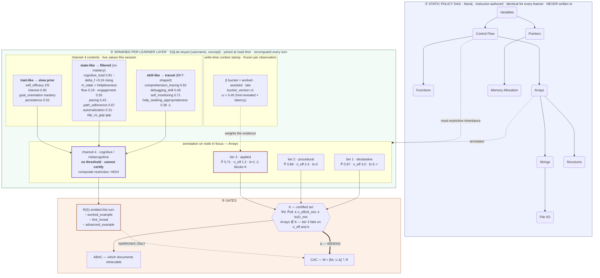

# Wiring Plan — learner model into ABAC + CAC

Remaining work for the journal extension. Substrate is ~80% built; claims are ~0% built.

**Claims**
1. Learner model tightens **ABAC** (earned credential) and **CAC** (explicit permitted-mode set).
2. Cognitive/metacognitive features = **4th channel**, ungated, feeds CAC only.
3. **Sign constraint** — earned attributes may widen release; inferred attributes may only narrow it.

**Status**
- Built: 3-tier BKT, revocable cert, ABAC prereq gate, per-observation logging *with tier*, MCN, ~17 learner vars, ablation harness.
- Absent: CAC mode set, β/ω/n_eff/diversity, 4th channel, propagation, review surface.
- **False (not absent):** the sign constraint. `socratic.py:281` lets affect *replace* the mastery policy.

---

## Architecture

Values shown are a live example: learner working on **Arrays**, mid-session.

**What the live values are saying**

- Tier 3 blocks certification twice over — `n_eff 1.2 < 3` (evidence discounted by ω) and `b=1 < D_min` (all of it from one context). Tier-complete-looking, contextually degenerate.
- `ω = 0.40` because the observation was hint-revealed and fast. Capped at 1 → gaming any input only lowers it.
- `cognitive_load 0.81`, `delta_f` rising, `m_state = Helplessness` → channel 4 emits a HIGH restriction, and `R(S)` withholds exactly the modes that would manufacture more hollow evidence.
- None of the channel-4 values touch `K`. They have no threshold and no path into certification.

**Invariants**
- ① is never written by anything downstream. Learner data in Neo4j = boundary violation.
- Only `Δ(C,K)` widens. `R(S)` subtracts. `M(C,K,S) ⊆ M(C,K)` for all S.
- Channel 4 has no threshold → structurally cannot certify.
- Restriction propagates downstream along prereq edges; never dilutes.

---

## Phase 0 — Repair (currently wrong)

| ID | Task | Where | Test |
|----|------|-------|------|
| R1 | Prereq gate bypassable by `"anyway"` / `"i know"`. Keep hatch, make it logged + non-certifying; down-weight evidence earned under bypass. | `cot_rag_agent.py:945` | Bypass leaves no trace → bypass recorded, evidence down-weighted |
| R2 | Affect **replaces** mastery format instead of subtracting (`if frustration / elif impatient / else ladder`). Pattern to copy: `socratic.py:596` (tone only). | `socratic.py:281, 298` | Proficient + high frustration gets analogy → never does |

## Phase 1 — CAC permission layer ★ critical path

| ID | Task | Where | Test |
|----|------|-------|------|
| C1 | Extract mode registry from scattered `format_builder.append()` into named mode set. | `socratic.py:435–555` | Byte-identical output at every mastery level (pure refactor) |
| C2 | `M₀(C)` — instructor base policy per concept. | `topic_settings.json`, `settings_manager.py` | No learner signals → released = M₀(C) |
| C3 | `Δ(C,K)` — modes certification adds. Reads `is_current_certified`, not sticky flag. | new | Empty K → released ⊆ M₀(C), no cold-start exception |
| C4 | `R(S)` — modes state removes. **Ships empty** (no-op) so Phase 1 lands standalone. | new | Subtraction is the only permitted operation |
| C5 | Compose `M = [M₀ ∪ Δ] \ R` as set ops. Intent selects *within* M, cannot expand. R2 lands properly here. | `socratic.py`, `cot_rag_agent.py` | Spoofed intent changes modes → changes only selection |
| C6 | Property test, generated states not examples. | `tests/` | `∀S: M(C,K,S) ⊆ M(C,K)` |

## Phase 2 — Evidence ledger (parallel to Phase 1)

| ID | Task | Where | Test |
|----|------|-------|------|
| L1 | Pass signal snapshot into `bkt.update()`. Signals already in scope, currently discarded. Cannot be reconstructed later (200-row sliding window + divergent second path). | 5 sites: `main.py:3823`, `examiner.py:284`, `cot_rag_agent.py:1407/1424/1439` | Observation records conditions, not just outcome |
| L2 | β (bucket: scaffold × help-density × session-position) + ω ∈ (0,1] as one pure fn at write time. Add `context_bucket`, `bucket_version`, `admissibility_weight`. | new module + `evidence_log` | **Assert ω ≤ 1.0 at write boundary** — this is the monotonicity guarantee the paper cites |
| L3 | Replace stored `n_evidence_*` with read-time `n_eff` (decayed weighted sum) + `b` (distinct buckets). Also fixes: counts currently never decay. | `bkt_model.py:456–465` | Tier-complete single-context evidence certifies → must not |
| L4 | Flags `admissibility_weighting_enabled`, `context_diversity_min`. | `config.py` SECURITY_FEATURE_NAMES | Both off → reproduces current decisions exactly (= ablation baseline row) |

## Phase 3 — 4th channel + annotation (needs C4)

| ID | Task | Where | Test |
|----|------|-------|------|
| M1 | Define channel. **Call it a channel, not a tier** — D stays 3-valued. Sort signals skill/state/trait; don't apply BKT to all 17. | `learner_model.py` | No channel value can produce a certification |
| M2 | Per-node annotation storage, keyed `(username, concept)`. Shape already exists (`skill-network` → `_read_row` per node). | SQLite; Neo4j untouched | Test: no code path writes learner data into Neo4j |
| M3 | Propagation: node inherits **most restrictive** annotation among prereqs. Without this the edges do nothing and it's a table, not a graph. | new | Adding a prereq restriction never loosens a dependent |
| M4 | Wire channel → `R(S)` only. "Enabling" must be absence-of-restriction, never addition. | single integration point | C6 still passes with channel live |
| M5 | Surface on skill-network. Currently 4 fields/node, `n_evidence` summed across tiers → collapses the tier factoring. | `main.py` `/api/v1/skill-network/` | Graph shows the ledger, not one number |

## Phase 4 — Visible + evaluable

| ID | Task | Where | Test |
|----|------|-------|------|
| E1 | Instructor review surface for flags + bypass records. | teacher dashboard | Flag reachable in 2 clicks with supporting observations |
| E2 | Structural invariants: hard-block precedence at max \|K\|, latitude floor, detector side-effect-free. | `tests/` | No cert count unlocks a hard block |
| E3 | Stale fixture: `um._save_db({})` gone since JSON→SQLite migration. Pre-existing. | `tests/test_user_manager.py:13` | 131 passed, 0 errors |

---

## Paper mapping

| Phase | Substantiates | Today |
|-------|---------------|-------|
| 0 | ABAC governs access · §1, §5 | falsified by one word |
| 1 | Sign constraint · §7 · CAC | **false**, not absent |
| 2 | Ledger, n_eff, diversity · §3–§6 | prerequisite met; rest absent |
| 3 | 4th channel, annotated graph · Claim 2 | absent (MCN = nearest existing) |
| 4 | E7, E8 | open on checklist |

## Open decisions

- [ ] **Channel restrict-only?** Note said "restricting enabling". If it may enable, Claim 3 dies. → blocks C4, M4
- [ ] **Propagation along edges?** If no, say "annotated node states" not "dynamic graph". → blocks M3
- [ ] **Which of the 17 signals?** Fewer well-typed beats all 17 alike. → blocks M1, M2
- [ ] **D_min + ω factors** — calibrate on class trial, not simulation. → tune after L2

## Order

`Phase 0` (cheap, independent) → `Phase 1` ★ → `Phase 3`. `Phase 2` runs parallel throughout.

If only one phase gets built: **Phase 1**. Critical path, carries the distinguishing property, and is the only claim the code currently *contradicts*.
